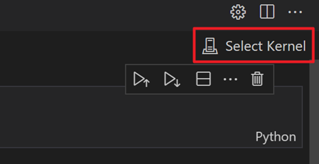
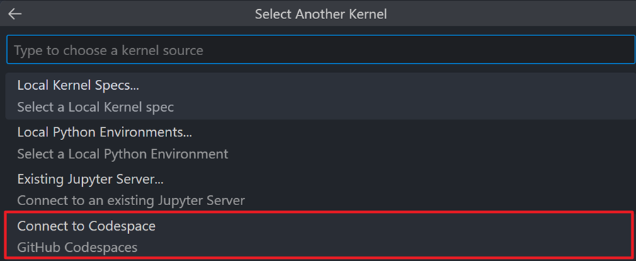
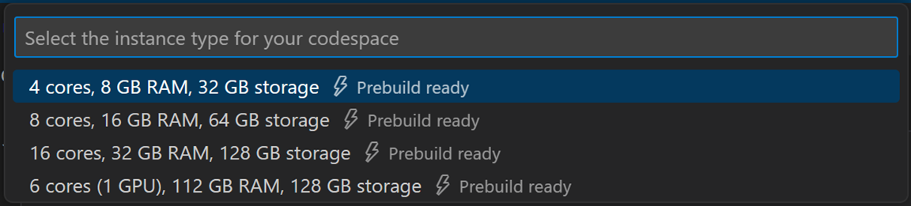
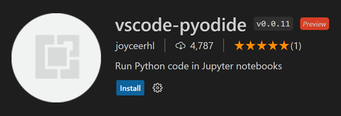
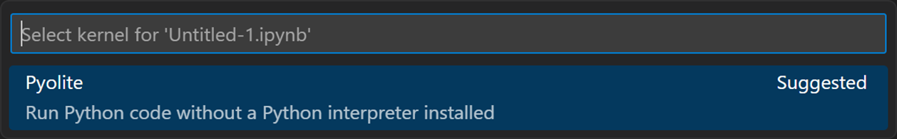
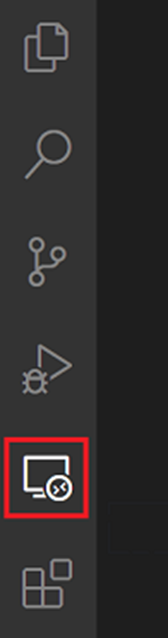

# Jupyter notebooks in VS Code running in the browser

Developing Jupyter notebooks in VS Code can be done entirely through a web-based interface provided by https://vscode.dev or https://github.dev (available by typing '.' when viewing a repo on https://github.com). You can read more about VS Code for the web [here](https://code.visualstudio.com/docs/editor/vscode-web).

While on the VS Code browser, you have the options to connect to the following types of kernels for your notebook:
1. GitHub-managed Jupyter server
2. Remote Jupyter server
3. Pyolite

There are some limitations to note with these kernel connections
- No access the VS Code terminal (though you can run [magic commands](https://ipython.readthedocs.io/en/stable/interactive/magics.html) from your notebook cells)
- Limited debugging
- Partial Python IntelliSense support
- No isort extension support

Alternatively, you can use [Codespaces](https://github.com/features/codespaces)—a fully configured cloud-hosted development environment—to take advantage of all VS Code functionalities.

## Connect to a GitHub-managed Jupyter server from VS Code browser

You can connect your notebook to a Jupyter server hosted on GitHub directly from the browser. To do so,

1. Open the kernel selector by clicking on `Select Kernel` from a notebook (you can also do so using the `Notebook: Select Notebook Kernel` command)

    

2. Select the `Connect to Codespace` option from the kernel picker

    

3. Select the instance type that is well suited for your project (you can change this later from https://github.com/codespaces)

    

    > **Note**: This option contributes to the storage and core hours of usage for GitHub Codespaces. For free GitHub accounts, the current limits are 15 GB of storage and 120 core hours per month. Click [here](https://docs.github.com/en/billing/managing-billing-for-github-codespaces/about-billing-for-github-codespaces#monthly-included-storage-and-core-hours-for-personal-accounts) for more info.

## Connect to a remote Jupyter server from VS Code browser

You can connect to a remote Jupyter server by selecting the `Jupyter: Specify Jupyter Server for Connections` command -> pasting the URL for your remote Jupyter server, e.g., `http://<ip-address>:<port>/?token=<token>`.


> **Note**: When you’re starting your remote server, ensure to: (1) alow all origins (e.g., `--NotebookApp.allow_origin='*'`) to allow your servers to be accessed externally, and (2) set notebook to listen to listen on all IPs (e.g., `--NotebookApp.ip='0.0.0.0'`).

## Connect to a Pyolite kernel from VS Code browser

You can connect to a Pyolite kernel—a Python kernel for VS Code notebooks based on [JupyterLite](https://github.com/jupyterlite/jupyterlite) and [Pyodide](https://pyodide.org/en/stable/development/core.html). You can use this kernel in two simple steps:

1. Install the [vscode-pyodide extension](https://marketplace.visualstudio.com/items?itemName=joyceerhl.vscode-pyodide) from the browser VS Code’s `Extensions` tab, then

    

2. Connect your notebook to the `Pyolite` kernel

    

    There are limitations to using the Pyolite kernel. The biggest one is that the kernel doesn’t have knowledge of the current working directory of your VS Code workspace. In other words, you won’t be able to refer to files in your working folder, and you’re only able to load publicly available files. Here is an example for loading a flat data file:

    ```{python}
    import pandas as pd
    import json
    from js import fetch

    response = await fetch('<url-to-file>')
    out = await response.text()
    filename = 'data.csv'

    with open(filename, 'w') as f:
        f.write(out)

    data = pd.read_csv(filename, sep=',')
    ```

    > **Note**: Please note the [Python packages built in Pyodide](https://pyodide.org/en/stable/usage/packages-in-pyodide.html) before deciding whether this option is the right one for your project.

## Connect to a Codespaces instance
You can also continue working on your browser notebook and/or project on [Codespaces](https://github.com/features/codespaces)—a fully configured cloud-hosted development environment. To do so:

1. Sign into Codespaces (i.e., `Codespaces: Sign in` command), then
2. Navigate to the Remote Explorer tab

    

From there, you can either connect to an existing Codespace or create a new one. This will open up a new window for you to continue working on your project.

## Questions or feedback

Please add a [feature request](https://github.com/microsoft/vscode-jupyter/issues/new?assignees=&labels=feature-request&template=3_feature_request.md) or [report a problem](https://github.com/microsoft/vscode-jupyter/issues/new?assignees=&labels=bug&template=1_bug_report.md) by logging an issue in our repository that is actively being monitored and managed by our engineering team.
